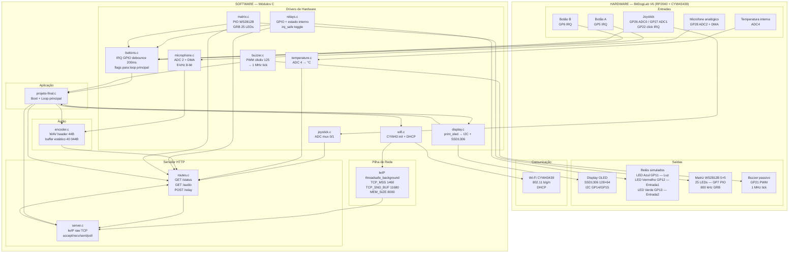
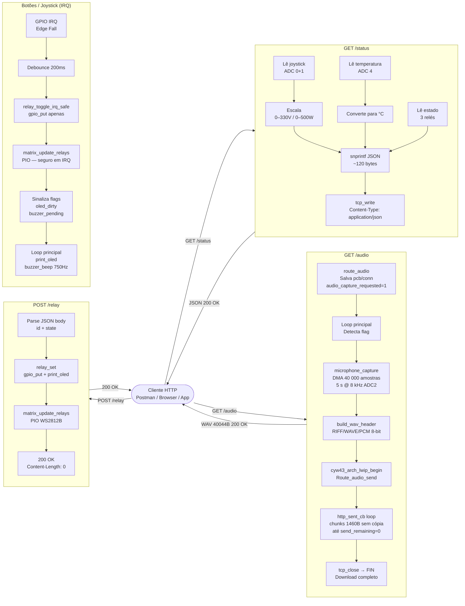

# Estrutura Hardware / Software

## Diagrama de Arquitetura

---

## Fluxo de dados por rota

---

## Módulos e responsabilidades

| Módulo | Arquivo | Responsabilidade |
|---|---|---|
| Boot + Loop | `projeto-final.c` | Sequência de init, loop principal, orquestra captura de áudio e flags de IRQ |
| Display | `display.c` | Abstração `print_oled()` sobre I2C + SSD1306 |
| Wi-Fi | `wifi.c` | Init CYW43, DHCP, exibe IP no OLED |
| Joystick | `sensors/joystick.c` | Leitura ADC multiplexado canais 0/1 |
| Temperatura | `sensors/temperature.c` | Leitura ADC canal 4, conversão datasheet RP2040 |
| Microfone | `sensors/microphone.c` | Config FIFO ADC canal 2, captura DMA 8-bit 8 kHz |
| Encoder WAV | `audio/encoder.c` | Cabeçalho RIFF/WAVE e buffer estático de 40 KB |
| Relés | `relays/relays.c` | GPIO dos LEDs simulados, toggle IRQ-safe, estado interno |
| Matriz LED | `leds/matrix.c` | PIO WS2812B 800 kHz, mapeamento GRB 25 LEDs |
| Botões | `buttons/buttons.c` | IRQ borda de descida GP5/6/22, debounce 200 ms, flags async |
| Buzzer | `buzzer/buzzer.c` | PWM clkdiv=125 (1 MHz tick), frequência e duração configuráveis |
| Servidor HTTP | `http/server.c` | lwIP raw TCP: accept, recv, sent (chunks 1 MSS), poll (retry ERR_MEM) |
| Rotas HTTP | `http/routes.c` | Handlers /status, /audio (assíncrono), /relay; despacho 404 |
